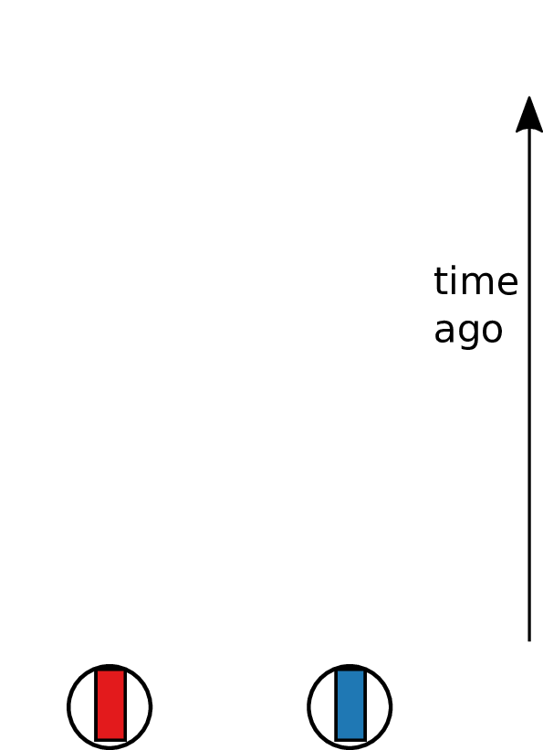
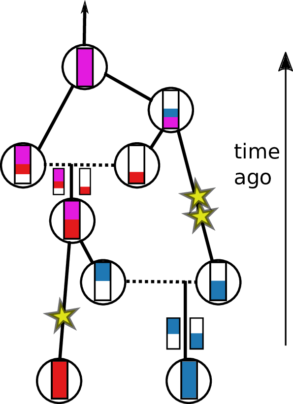
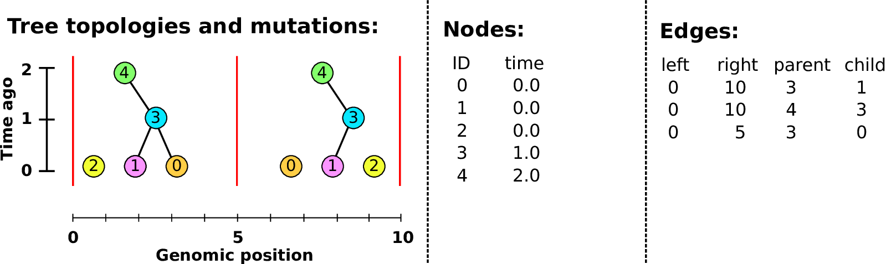
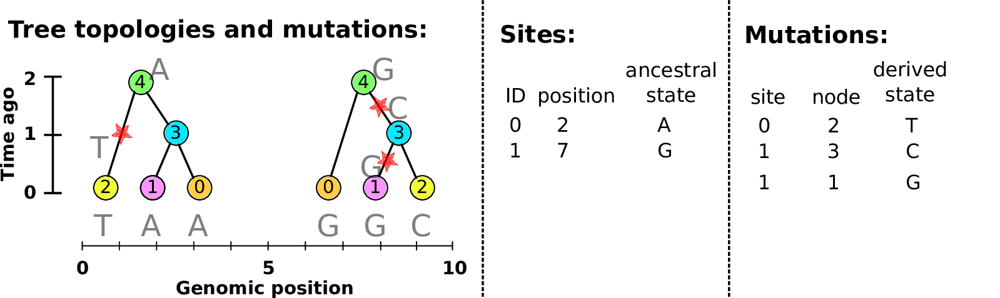

# Genomes and genealogies

## Genomes

::: {.columns}
::::::: {.column width=50%}

- are very big ($10^7$--$10^{12}$ nucleotides)
- reflect past *history* and *process*

. . .

*For example, in humans:*

- out of $3 \times 10^9$ nucleotides,
- individuals differ at around 5 million sites
- upcoming datasets: millions of individuals
    at tens of millions of varying sites
<!-- 88 million varying sites in 2500 genomes
     1000G: https://www.nature.com/articles/nature15393 -->

:::
::::::: {.column width=50%}

::: {.centered}

:::

:::
:::::::

## 

A data structure is...

. . .

**succinct** if it
only stores each bit of information once.

. . .

**descriptive** if it
reflects the underlying process.

. . .

**So:** let's think about the process that generated the data!

## Meiosis & Recombination

::: {.centered}
You have two copies of each chromosome, 
  one from each parent.
:::

. . .

::: {.centered}
When you make a gamete, the copies *recombine*,

and copying errors lead to *mutations*.
:::

## 

Each two copies of the genome
were inherited, noisily, from the two parents,

. . .

and from the four grandparents,

. . .

and the eight great-grandparents

. . .

and the sixteen great-great-grandparents

. . .

... but, how much from each of them?

<!--
**but:** you have not inherited *any* genome from *most* of your ancestors,
past about 10 generations ago.
-->

## 

::: {.centered}
{width=60%}

::: {.caption}
from [gcbias.org](https://gcbias.org/2013/11/11/how-does-your-number-of-genetic-ancestors-grow-back-over-time/)
:::
:::

<!--
## 

::: {.centered}
{width=60%}

::: {.caption}
from [gcbias.org](https://gcbias.org/2013/11/11/how-does-your-number-of-genetic-ancestors-grow-back-over-time/)
:::
:::

-->

# Looking backwards

##

::: {.columns}
::::::: {.column width=50%}

Tracing back the 
ancestry of some chromosomes:

- blocks labeled by who inherits from them
-  blocks can *split* 
-  or *coalesce*, 
-  and *mutations* lead to differences. 

Result: a *labeled genealogy* containing all the *genealogical trees*.

:::
::::::: {.column width=50%}

:::: {.floatright}
{width=80%}
::::

:::
::::::: 

##

::: {.columns}
::::::: {.column width=50%}

Tracing back the 
ancestry of some chromosomes:

- blocks labeled by who inherits from them
- blocks can *split*
-  or *coalesce*, 
-  and *mutations* lead to differences. 

Result: a *labeled genealogy* containing all the *genealogical trees*.

:::
::::::: {.column width=50%}

:::: {.floatright}
{width=80%}
::::

:::
::::::: 

##

::: {.columns}
::::::: {.column width=50%}

Tracing back the 
ancestry of some chromosomes:

- blocks labeled by who inherits from them
- blocks can *split*
- or *coalesce*,
-  and *mutations* lead to differences. 

Result: a *labeled genealogy* containing all the *genealogical trees*.

:::
::::::: {.column width=50%}

:::: {.floatright}
{width=80%}
::::

:::
::::::: 

##

::: {.columns}
::::::: {.column width=50%}

Tracing back the 
ancestry of some chromosomes:

- blocks labeled by who inherits from them
- blocks can *split*
- or *coalesce*,
-  and *mutations* lead to differences. 

Result: a *labeled genealogy* containing all the *genealogical trees*.

:::
::::::: {.column width=50%}

:::: {.floatright}
{width=80%}
::::

:::
::::::: 

##

::: {.columns}
::::::: {.column width=50%}

Tracing back the 
ancestry of some chromosomes:

- blocks labeled by who inherits from them
- blocks can *split*
- or *coalesce*,
-  and *mutations* lead to differences. 

Result: a *labeled genealogy* containing all the *genealogical trees*.

:::
::::::: {.column width=50%}

:::: {.floatright}
{width=80%}
::::

:::
::::::: 

##

::: {.columns}
::::::: {.column width=50%}

Tracing back the 
ancestry of some chromosomes:

- blocks labeled by who inherits from them
- blocks can *split*
- or *coalesce*,
-  and *mutations* lead to differences. 

Result: a *labeled genealogy* containing all the *genealogical trees*.

:::
::::::: {.column width=50%}

:::: {.floatright}
{width=80%}
::::

:::
::::::: 

##

::: {.columns}
::::::: {.column width=50%}

Tracing back the 
ancestry of some chromosomes:

- blocks labeled by who inherits from them
- blocks can *split*
- or *coalesce*,
- and *mutations* lead to differences.

Result: a *labeled genealogy* containing all the *genealogical trees*.

:::
::::::: {.column width=50%}

:::: {.floatright}
{width=80%}
::::

:::
::::::: 

##

::: {.columns}
::::::: {.column width=50%}

Tracing back the 
ancestry of some chromosomes:

- blocks labeled by who inherits from them
- blocks can *split*
- or *coalesce*,
- and *mutations* lead to differences.

Result: a *labeled genealogy* containing all the *genealogical trees*.

:::
::::::: {.column width=50%}

:::: {.floatright}
{width=80%}
::::

:::
::::::: 

<!-- explain tree sequences and why they are so efficient (5min) -->
# The tree sequence

## History is a sequence of trees

For a set of sampled chromosomes,
at each position along the genome there is a genealogical tree
that says how they are related.

. . .

{width=100%}

----------------------

The **succinct tree sequence**

::: {.floatright}
is a way to succinctly describe this, er, sequence of trees

*and* the resulting genome sequences.
:::

. . .

::: {.floatright}
{width=50%}

:::: {.caption}
by Jerome Kelleher,
in [Kelleher, Etheridge, and McVean](http://journals.plos.org/ploscompbiol/article?id=10.1371/journal.pcbi.1004842) 
::::
:::

## Example: three samples; two trees; two variant sites

## Nodes and edges

Edges 

:   Who inherits from who.

    Records: interval (left, right); parent node; child node.

Nodes 

:   The ancestors those happen in.

    Records: time ago (of birth); ID (implicit).

-------------------

-------------------

-------------------

-------------------

-------------------

-------------------

-------------------

## Sites and mutations

Mutations

:   When state changes along the tree.

    Records: site it occured at; node it occurred in; derived state.

Sites 

:   Where mutations fall on the genome.

    Records: genomic position; ancestral (root) state; ID (implicit).

------------------

------------------

------------------

------------------

------------------

------------------

**The result:**
an encoding of the genomes *and* all the genealogical trees.

::: {.centered}

:::

# How's it work?

## File sizes

::: {.centered}
{width=90%}
:::

::: {.caption}
100Mb chromosomes;
from [Kelleher et al 2018, *Inferring whole-genome histories in large population datasets*](https://www.nature.com/articles/s41588-019-0483-y), Nature Genetics
:::

<!-- Estimated sizes of files required to store the genetic variation data for a
simulated human-like chromosome (100 megabases) for up to 10 billion haploid
(5 billion diploid) samples. Simulations were run for 10 1 up to 10 7 haplotypes
using msprime [Kelleher et al., 2016], and the sizes of the resulting files plotted
(points). -->

---------------

---------------

---------------

## For $N$ samples genotyped at $M$ sites

::: {.columns}
::::::: {.column width=50%}

*Genotype matrix*: $O(NM)$

$N \times M$ things.

:::
::::::: {.column width=50%}

*Tree sequence:* $O(N + T + M)$

- $2N-2$ edges for the first tree
- $\sim 4$ edges per each of $T$ trees
- $M$ mutations

:::
:::::::

{width=70%}

## Fast genotype statistics

::: {.centered}
{width=70%}
:::

::: {.caption}
from [R., Thornton and Kelleher 2020, *Efficiently summarizing relationships in large samples*](https://doi.org/10.1534/genetics.120.303253), *Genetics*
:::

# In SLiM

## The main idea

If we *record the tree sequence*
that relates everyone to everyone else,

after the simulation is over we can put neutral mutations down on the trees.

. . .

Since neutral mutations don't affect demography,

this is *equivalent* to having kept track of them throughout.

------------

This means recording the entire genetic history of **everyone** in the population, **ever**.

.  . .

It is *not* clear this is a good idea.

## Tree recording strategy

Every time an individual is born, we must:

::: incremental

1. add each gamete to the Node Table,
2. add entries to the Edge Table
    recording which parent each gamete inherited each bit of genome from, and
3. add any new selected mutations to the Mutation Table 
    and (if necessary) their locations to the Site Table.

:::

. . .

::: {.columns}
:::::: {.column width=15%}

{width="100%"}

:::
:::::: {.column width=5%}

:::
:::::: {.column width=75%}

This produces **waaaaay** too much data.

:::
::::::

-------------------

We won't end up needing the *entire* history
of *everyone ever*,

. . .

but we won't know *what* we'll need until later.

. . .

How do we get rid of the extra stuff?

. . .

**Simplification.**

----------------

{width=100%}

----------------

{width=100%}

----------------

{width=100%}

----------------

{width=100%}

----------------

{width=100%}

# Wrap up

## Software

::: {.columns}
::::::: {.column}

Everything is efficient, open, and tested.

{width=100%}

:::
::::::: {.column}

- `tskit`: tree sequence tools 

    [github:tskit-dev/tskit](https://github.com/tskit-dev/tskit)

- `stdpopsim`: a library of "standard" simulation tools

    [github:popsim-consortium/stdpopsim](https://github.com/popsim-consortium/stdpopsim)

- `msprime`: coalescent simulator,

    [github:tskit-dev/msprime](https://github.com/tskit-dev/msprime)

- `SLiM` : forwards evolutionary simulator

    [messerlab.org/slim](https://messerlab.org/slim/)

:::
:::::::

## Thanks

::: {.columns}
:::::::: {.column}

- Jerome Kelleher
- Yan Wong
- Ben Jeffery
- Ben Haller
- Georgia Tsambos
- Jared Galloway
- Nate Pope
- Gerjan Bisschop
- Shing Hei Zhan
- Ava Bamforth
- Halley Fritze
- `tskit-dev` and `popsim-consortium`

:::
:::::::: {.column}

Funding: NSF, NIH, UO (PR); Wellcome Trust (JK);

Slides with [reveal.js](http://hakim.se) and [pandoc](https://pandoc.org/).

{width=50%}

:::
::::::::
